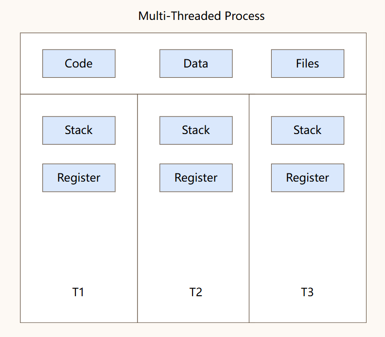

## 进程和线程

### 进程

系统资源分配的独立基本单位

进程是程序的实例化

**进程控制块（PCB）**

存储进程的元信息，辅助操作系统对进程进行管理


| 进程描述信息 | 控制和管理信息  | 资源分配清单 | 处理机相关信息 |
| ------ | -------- | ------ | ------- |
| 进程标识符  | 进程状态     | 代码段指针  | 通用寄存器值  |
| 用户标识符  | 进程优先级    | 数据段指针  | 地址寄存器值  |
|        | 代码运行入口地址 | 堆栈段指针  | 控制寄存器值  |
|        | 程序外存地址   | 文件描述符  | 标志寄存器值  |
|        | 等待事件     |        |         |
|        | CPU占用时间  |        |         |
- 进程创建和终止时诞生和被删除
- 进程调度时，PCB要配合操作系统决策


**父子进程**

mit章节已经解释

- **fork**：创建 **子进程**，复制 **资源**，不改变程序，**父子进程** 继续执行原代码。
- **exec**：在当前 **进程** 中加载并执行一个新的程序。替换当前 **进程** 的 **代码段**、**数据段** 和 **堆栈**，保留部分 **资源** 如 **进程 PID**，不涉及到并发。

```ad-info
title:僵尸进程和孤儿进程

**僵尸进程**：子进程已经完成，但其状态没有被父进程回收，仍占用PID

**孤儿进程**：子进程仍在运行但父进程已经结束了，子进程永远不可能被回收
```

## 线程

**线程是系统调度的基本单位**



## 进程的状态

>反映当前进程正在做什么，是否可以被CPU执行

