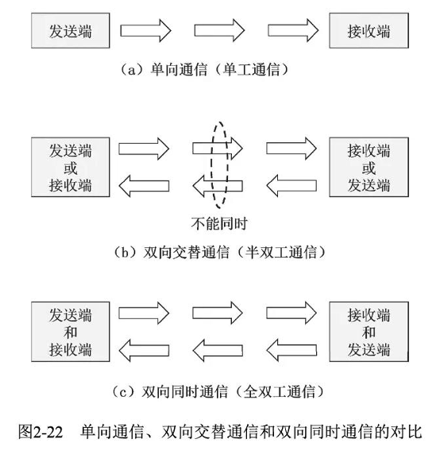
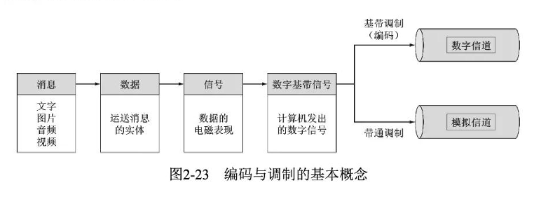
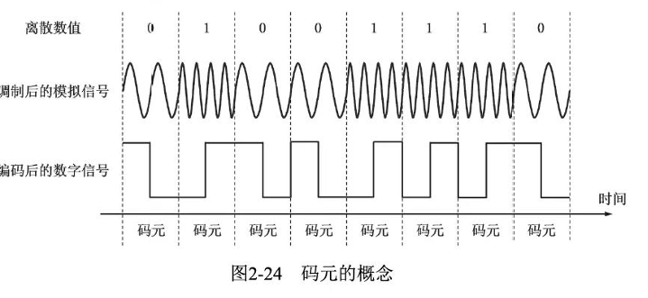
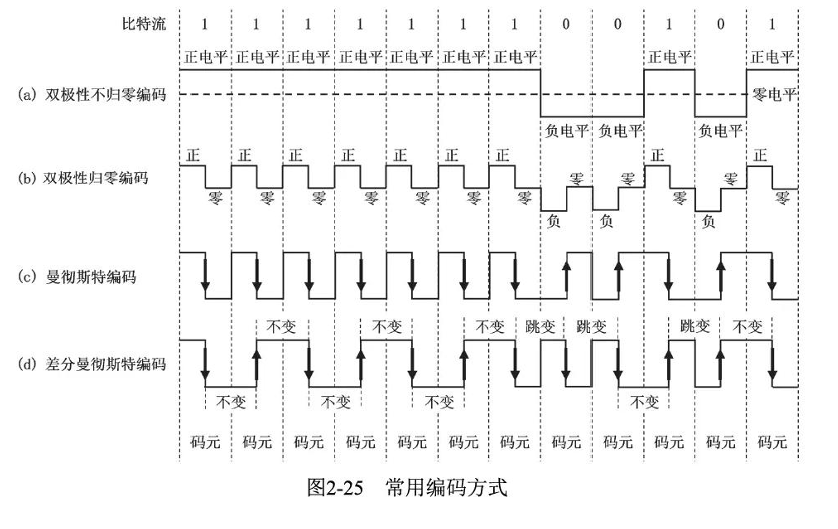
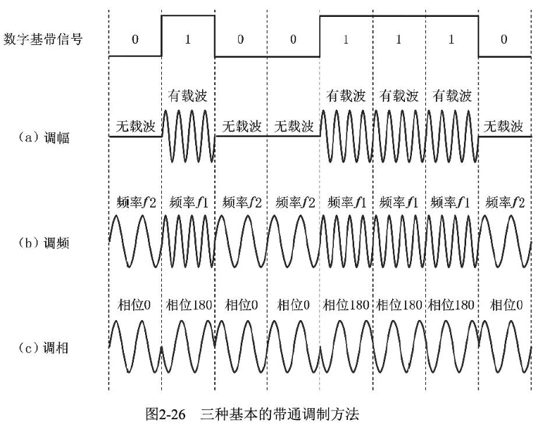
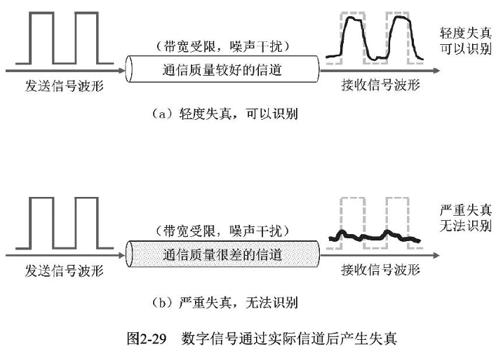

## 物理层

### 概述

- 传输透明比特流，为数据链路层封装好服务
- 物理接口特性：
	- 机械特性
	- 电气特性
	- 功能特性：数据线？控制线？时钟线？地线？
	- 过程特性：各信号之间的时序关系
- 导向型传输媒体：
	- 同轴电缆
	- 双绞线
	- 光纤
- 非导向型传输媒体：
	- 无线电波
	- 微波
	- 红外线激光可见光

### 传输方式

#### 串行/并行传输

- **串行传输**：
	
- **并行传输**：速度快，多用于计算机内部数据传输
	
#### 同步/异步传输

==同步异步指的是时间间隔是否固定==
- 同步传输方式：无字节间隔，无起始和中止位，要求双方对齐时间长度。
	- **外同步**：利用外部时间线发送时钟信号，实现同步
	- **内同步**：将时钟信息编码到发送数据中，如曼彻斯特编码和差分曼彻斯特编码
- 异步传输方式：
	以字节为处理单位，但字节之间的时间间隔不固定，但是字节里的比特是同步的

#### 单项通信/双向交替通信和双向同时通信

- 单向通信
- 双向交替通信：双端都可以收发信息，但是不能同时收发
- 双向同时通信：双端都可以收发信息，可以同时收发
	

### 编码和调制

#### 基本概念

- 消息、数据和信号
- 基带信号：由信源发出的原始信号，需要进行调制才能在信道上进行传播
- 调制和编码：
	- 基带调制（编码）：变换波形，即用什么样的信号表示0和1，离散的物理状态
	- 带通调制：转换频段，连续的正弦波
	

>### 什么是低频
>“可不可以解释一下什么叫做频率较低的信号，我的理解中信号只有呈周期变化的时候才有所谓的频率一说吧，但是基带信号并不是呈周期性变化的啊”
>这里的核心思想是：​**任何一个信号，无论它多复杂，是否周期变化，都可以被看作是由许多个不同频率、不同幅度的基本正弦波“叠加”而成的**​。而分析一个信号中包含哪些频率的正弦波成分（即“频率成分”），以及每个成分的“强度”是多少，就是**傅里叶分析**所做的事情
>​**概念的扩展**​：通过傅里叶分析，​**​“频率”的概念被扩展为描述任何信号能量在频域上的分布情况**。我们说的“低频信号”，通常指的是其主要频率成分分布在低频段

- 码元：信号的编码单位，在使用时间域的波形表示信号的时候，代表不同离散数值的基本波形被称为码元
	

#### 常用编码方式

- 不归零制
	信号在每个码元期间不会回到零电平，==效率最高，存在同步问题==
- 归零制
	信号在每个码元期间都会回到零电平，将时钟信号参与编码，==自同步信号，效率低==
- 曼彻斯特编码
	在每个码元的中间时刻电平发生跳变，该跳变既表示时钟信号也表示数据，==自同步信号，效率更高==
- 差分曼彻斯特编码                                    
	基于曼彻斯特编码，==但是中间时刻电平变化仅表示时钟信号==，抗干扰
	
	
	

#### 基本带通调制和混合调制方法

- 调幅：载波的幅度随基带数字信号的变化而变化
- 调频：频率
- 调相：初相位

- 混合调制方法：
	`使用技术上更为复杂的混合调制方法，让一个码元可以表示多个比特的信息量`
	- 正交振幅调制：
		
		
### 信道的极限容量

*坦克是没有后视镜的，信号是会失真的*

#### 奈氏准则

$$
理想低通信道的最高码元传输速率=2WBaud
$$
#### 香农公式

### 信道复用技术
## 数据链路层

### 概述

==该层主要实现的是帧在一段链路或一个网络中进行传输的问题==

- 链路：一个节点到相邻节点的一段物理线路（中间没有其他节点）
- 数据链路：链路本身+通信协议下的软硬件，链路的具象化
- 帧：数据链路层的PDU
![[Pasted image 20251014143127.png]]

数据链路层不必考虑物理层如何实现比特流传输
### 三个重要问题

- 封装成帧和透明传输
	- 封装成帧
		给网络层交付下来的分组添加一个首部和一个尾部，帧定界
		![[Pasted image 20251014143348.png]]
	- 透明传输
		初衷是为了防止数据在和部分出现了帧定界符
		![[Pasted image 20251014145242.png]]
		==方法==
		**字节填充** ：
		**比特填充** ：
	MTU：最大传送单元
- 差错检测
	- 奇偶校验
	- 循环冗余校验
- 可靠传输